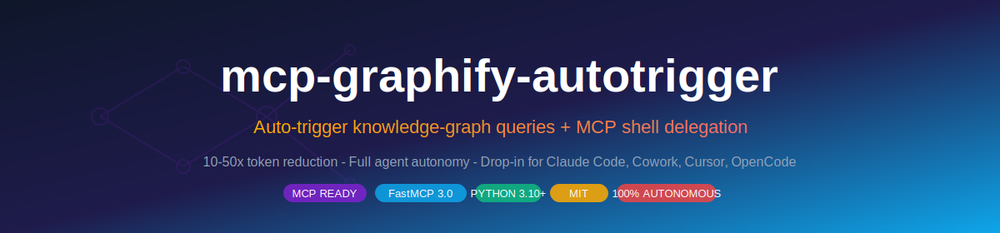
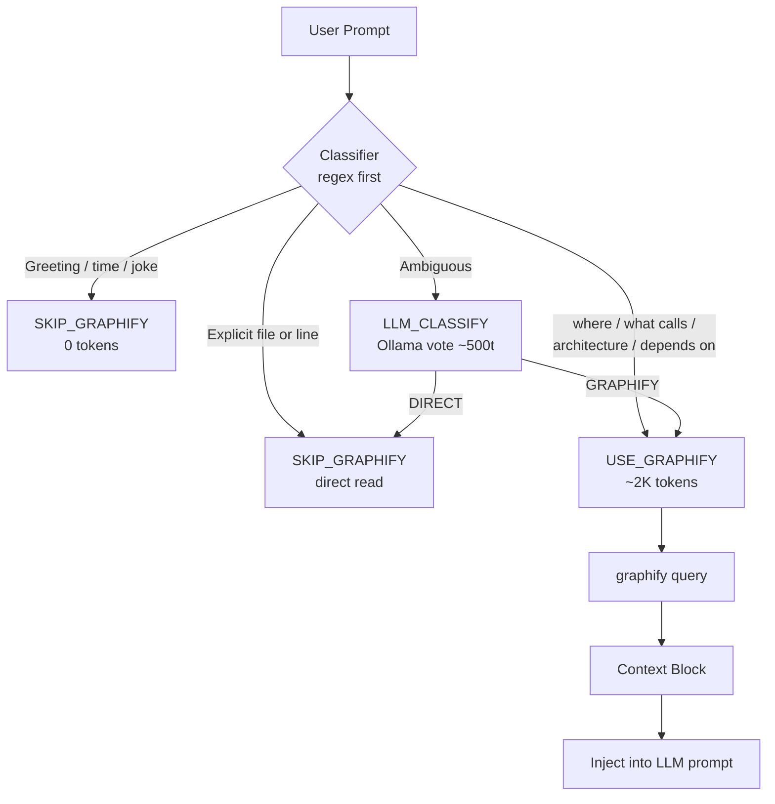

<p align="center">
  
</p>

<p align="center">
  <a href="https://github.com/ChharithOeun/mcp-graphify-autotrigger/actions/workflows/ci.yml"></a>
  <a href="https://opensource.org/licenses/MIT"></a>
  <a href="https://www.python.org/downloads/"></a>
  <a href="https://modelcontextprotocol.io"></a>
  <a href="https://gofastmcp.com"></a>
  
  
  
  
  <a href="https://buymeacoffee.com/chharith"></a>
</p>

<p align="center">
  <strong>Auto-trigger graphify knowledge-graph queries on every LLM prompt + MCP shell delegation for Claude Code / Cowork agents.</strong>
  <br/>
  Turn 200K-token codebase context dumps into 2K-token graph queries. Give your AI agent unrestricted shell autonomy when tier-restricted apps get in the way.
</p>

---

## Why

### Token savings - concrete

| Approach          | Tool calls | Tokens (avg) | Cost @ Sonnet 4 |
|-------------------|-----------|--------------|-----------------|
| read + grep       | 30+       | 150K-300K    | \.45-\.90 |
| **graphify query** | 1         | **~2K**      | **\.006** |

Net **80-150x reduction** on cross-cutting code questions. The auto-trigger classifier decides per-prompt whether to query the graph, so simple `fix login.py:42` prompts pay no extra cost.

### Autonomy - concrete

Claude Code / Cowork enforces tier-based restrictions: terminals are click-only, browsers are read-only. Without delegation, an agent debugging your Windows machine can't `pip install`, can't `git commit`, can't run any shell command. With `delegate_shell` it routes through your unrestricted Python process: full autonomy, audit-logged, your config flag away from disabling.

## How the auto-trigger decides



## Quick Start

```bash
# 1. Install
pip install mcp-graphify-autotrigger[all]

# 2. Set up graphify CLI + the slash command in your AI assistant
graphify install
graphify claude install

# 3. Build the first graph for any folder
cd /path/to/your/repo
graphify update .

# 4. Register the MCP server with Claude Code / Cowork
claude mcp add chharbot_tools -- python -m mcp_server.server

# 5. Restart your assistant
```

After registering and restarting, the new tools (`delegate_shell`, `graphify_query`, `graphify_build`, `graphify_preflight`, `graphify_classify`, `graphify_path`, `tools_status`) appear in the assistant's tool list.

## Features

- **Regex-first classifier** with 14/14 self-test, LLM fallback for ambiguous cases
- **Universal** - works on any drive, any folder (not project-specific)
- **Per-target graph cache** at `~/.chharbot/graphs/<sha256(realpath)>/` so repeat queries are cheap
- **Token-cost-aware** - returns expected cost so the brain can pick the cheaper route
- **Graceful degradation** - if graphify isn't installed, the wrapper says so without crashing
- **stdin / stdout / stderr capture** with size caps (256KB / 64KB out, 1MB stdin)
- **Audit log** at `~/.chharbot/delegate-audit.log` (JSONL) for every shell delegation
- **MCP-ready** - exposes 7 FastMCP tools out of the box
- **Security-hardened** - input size caps, audit logging, ReDoS-safe regex (see [SECURITY.md](./SECURITY.md))

## Usage

### As a Python library

```python
from autotrigger.preflight import preflight, discover_targets

pf = preflight(
    prompt="how does the auth flow work in this repo",
    targets=discover_targets(),
    auto_build=True,
)
if pf.context_block:
    user_message = pf.context_block + "\n\n---\n\n" + user_message
```

### Drop-in patch

See [`examples/agent_run_patch.py`](./examples/agent_run_patch.py) - 8 lines you paste at the top of your `run()` method, before the LLM call.

### MCP tools exposed

| Tool                 | Description |
|----------------------|-------------|
| `delegate_shell`     | Run any shell command on chharbot's unrestricted Python. No allowlist. Audit-logged. |
| `graphify_query`     | English query against any drive/folder's knowledge graph. |
| `graphify_build`     | Build/rebuild a graph for any folder. |
| `graphify_path`      | Shortest path between two nodes. |
| `graphify_preflight` | Always-on auto-trigger; returns injectable Markdown context block. |
| `graphify_classify`  | Classifier-only without running graphify. |
| `tools_status`       | Health check (graphify installed, audit log size, cached graphs). |

## Security

This package gives external agents **unrestricted shell access** through `delegate_shell`. That is the explicit design goal (closing autonomy gaps in tier-restricted environments), but it requires you to think about who can call your MCP server.

See [SECURITY.md](./SECURITY.md) for:
- Threat model
- Hardening recommendations (allowlist wrapper, env-var gating, audit log rotation)
- Tested attack vectors (command injection, path traversal, ReDoS, OOM)

## Related

- [graphify](https://github.com/safishamsi/graphify) - the underlying knowledge-graph CLI by [@safishamsi](https://github.com/safishamsi)
- [FastMCP](https://gofastmcp.com) - the MCP server framework
- [Model Context Protocol](https://modelcontextprotocol.io) - the spec

## Contributing

PRs welcome! Run the test suite with `pytest` before opening a PR. CI exercises Python 3.10-3.13 on Ubuntu and Windows.

## License

MIT - see [LICENSE](./LICENSE).

## Support

If this saves you tokens or unblocks your agent, consider buying me a coffee:

<p align="center">
  <a href="https://buymeacoffee.com/chharith"></a>
</p>

Issues and PRs welcome at [GitHub](https://github.com/ChharithOeun/mcp-graphify-autotrigger/issues).

